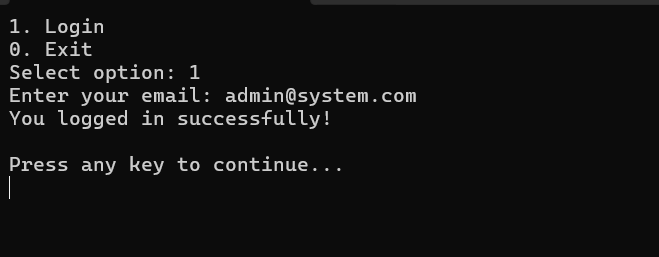
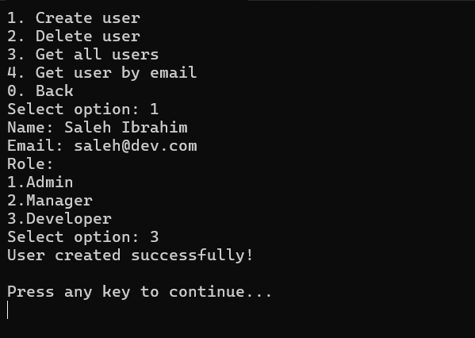
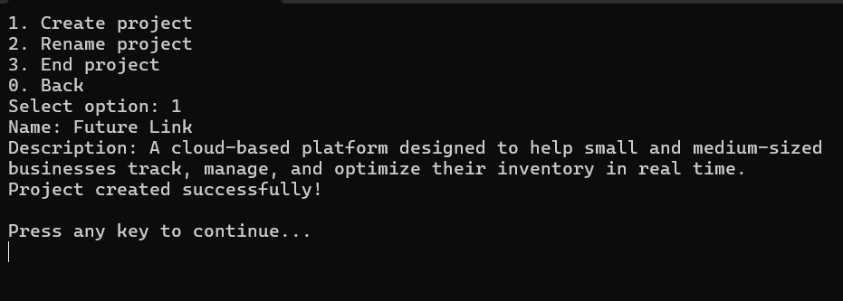
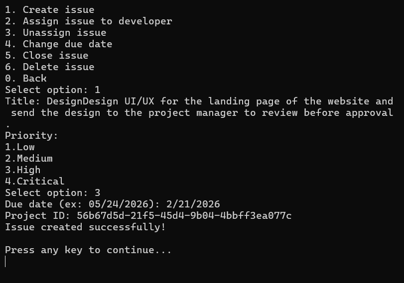
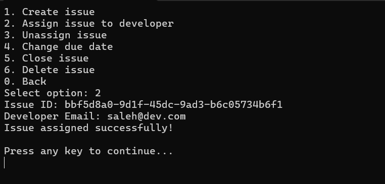
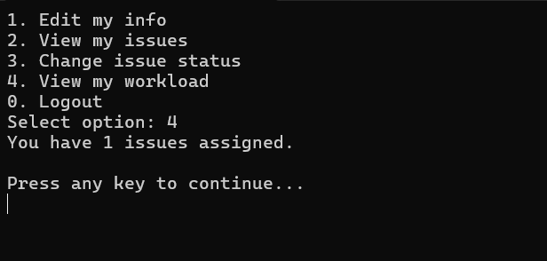

# Smart Issue Tracking System

## Description

**Smart Issue Tracking System** is a console-based application designed to simulate a real-world issue tracking workflow similar to those used in software companies.  
It supports **Admins, Managers, and Developers**, each with clearly defined responsibilities, and follows **clean architecture principles** with proper separation of concerns.

The project focuses on **software design quality**, not just functionality, applying SOLID principles, layered architecture, domain-driven thinking, and realistic workflows such as authentication, authorization, project lifecycle management, and reporting.

---

## Table of Contents

- Description  
- Features  
- Tech Stack  
- Project Structure  
- Installation  
- Usage  
- Screenshots  
- Future Improvements  
- License  
- Contributing  

---

## Features

### Admin Features
- Create, view, and delete users
- Assign or reassign projects to managers
- View all projects and users

### Manager Features
- Create, rename, and end projects
- Create, assign, unassign, close, and delete issues
- Change issue priority and due dates
- View issues grouped by:
  - Project
  - Developer
  - Status
  - Priority
- View project progress and issue statistics
- View overdue and incomplete issues

### Developer Features
- View assigned issues grouped by project
- Change issue status
- View personal workload

### System Features
- Authentication & authorization
- JSON-based persistence
- Role-based menus
- Reporting and statistics
- Clean error handling at presentation level
- Fully documented public APIs (XML documentation)

---

## Tech Stack
- **Language:** C#
- **Framework:** .NET (Console Application)
- **Architecture:** Clean / Layered Architecture
- **Persistence:** JSON file storage
- **Documentation:** XML Documentation + Markdown
- **Design Principles:** SOLID, DRY, Separation of Concerns
- **Design Patterns:** Repository

---

## Project Structure
```text
SmartIssueTrackingSystem
│
├── assets/                # Screenshots
├── docs/                  # UML diagram, requirements, and use cases
├── src/
│   ├── Application/
│   │   ├── Interfaces/
│   │   └── Services/
│   ├── Domain/
│   │   ├── Entities/
│   │   └── Enums/
│   ├── Infrastructure/
│   │   ├── Interfaces/
│   │   └── Repositories/
│   └── UI/
│       ├── Menus/
│       ├── ConsoleApp.cs
│       └── MenuCoordinator.cs
│
├── Program.cs
├── README.md
├── LICENSE.txt
└── .gitignore
```

---

## Installation
1. Clone the repository:
```bash
git clone https://github.com/AhmedMohamedGab/Smart-Issue-Tracking-System.git
```
2. Open the solution in Visual Studio
3. Restore dependencies (if needed)
4. Run the project:
```bash
dotnet run --project SmartIssueTrackingSystem.csproj
```

## Usage
1. Start the application
2. Log in using an existing user email
3. Navigate through role-based menus
4. Perform actions based on your role (Admin / Manager / Developer)
5. Log out or exit safely
> All invalid operations are handled gracefully through user-friendly console messages.

## Screenshots
- Login Screen:



- Admin Creates User:



- Manager Creates Project:



- Manager Creates Issue:



- Manager Assigns Issue:



- Developer Views Workload:



## Future Improvements
- Unit and integration testing
- Password hashing and secure authentication
- Database persistence (SQL / NoSQL)
- Logging system
- CLI arguments support
- Export reports to files
- REST API version of the system

## License
This project is licensed under the **MIT License**.
See the `LICENSE.txt` file for details.

## Contributing
Contributions are welcome! Please follow these steps:
1. Fork the repository
2. Create a new branch for your feature or bug fix
3. Make your changes and commit with clear messages
4. Push to your fork and create a pull request
5. Wait for code review and merge

Thank you for contributing to the Smart Issue Tracking System!
